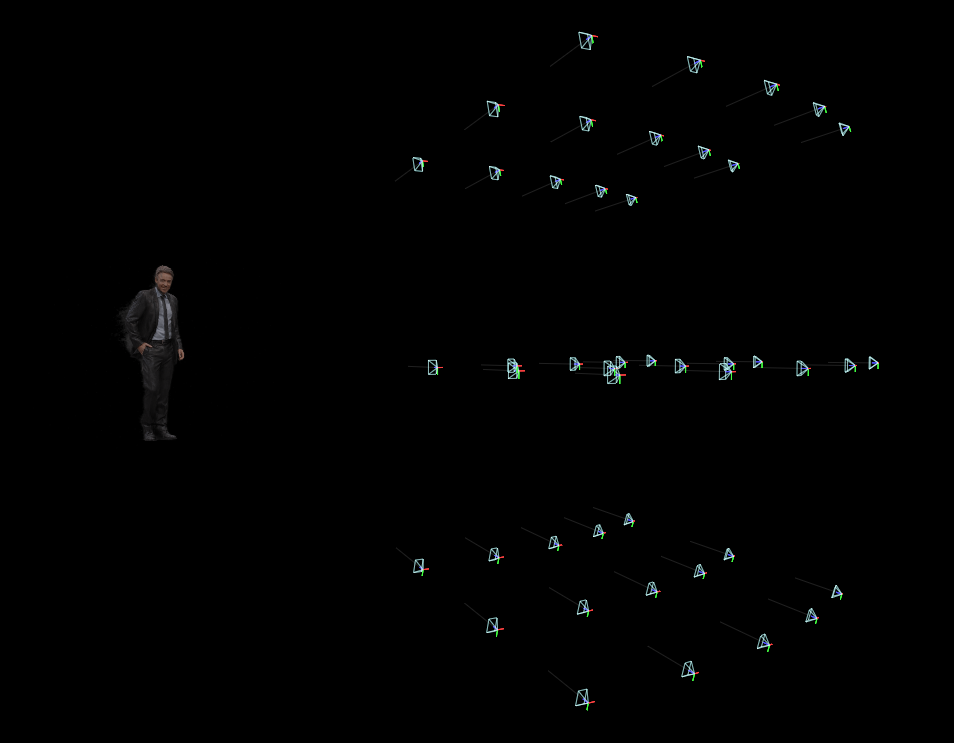
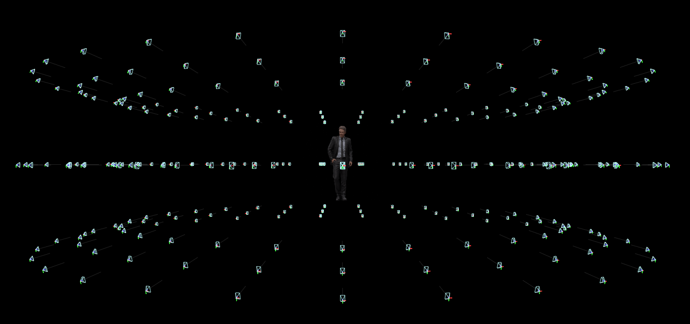
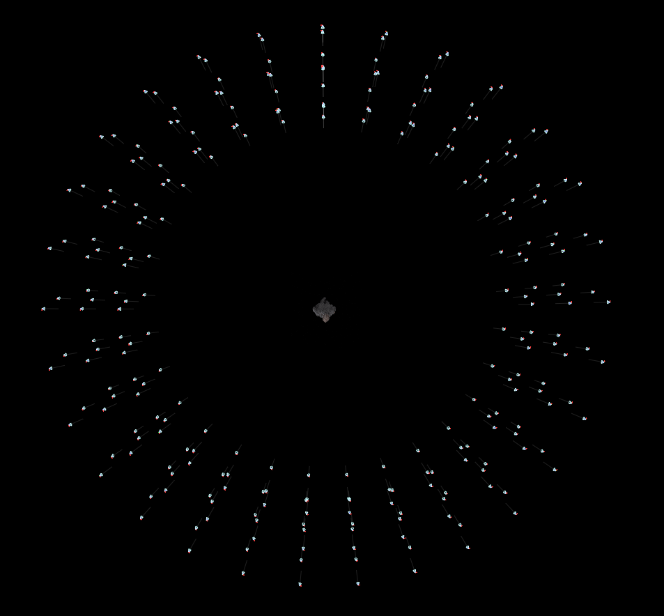
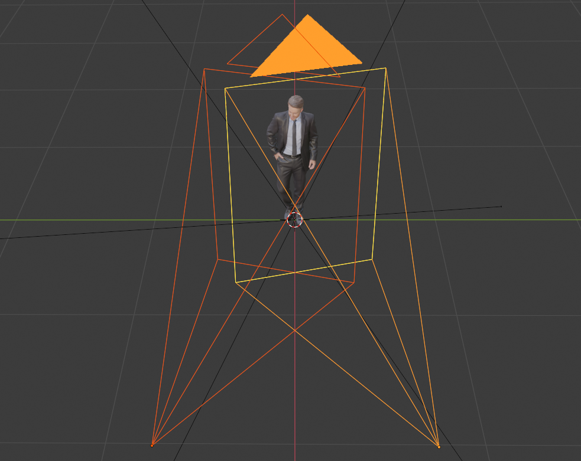
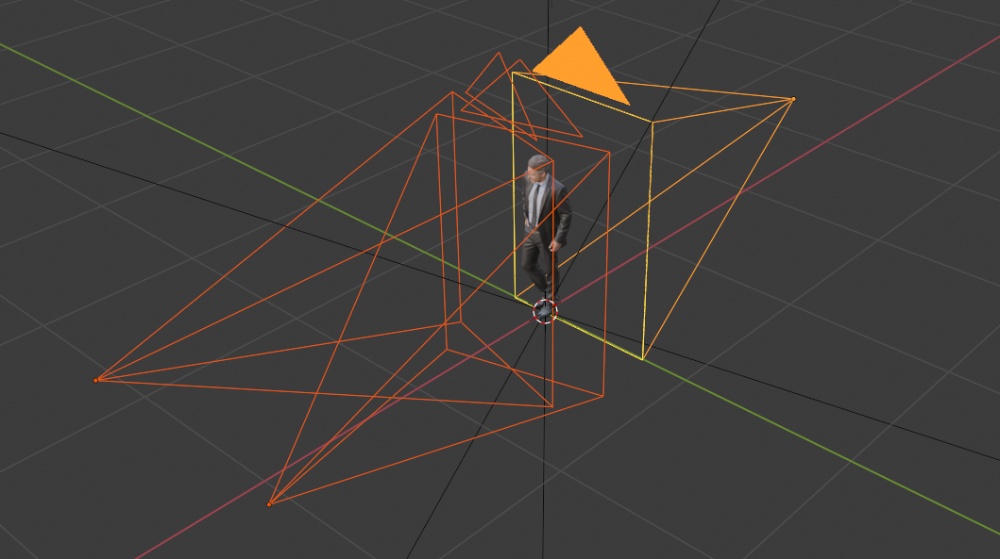

# Testing NeRF

## Testing dataset

### Focus view

Generates views within 30 degrees of object front field of view in latitude and longitude, with different radius.
Total of 45 cameras views.

---
### Full view
Generated views 360 degrees around the object, with total 270 cameras.

## Camera config 1

## Camera config 2

## Camera config 3

##  

